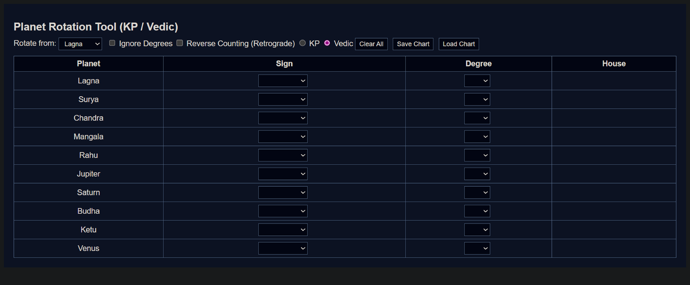

# Planetary Rotation Calculator

A browser-based rotation and relative-position calculation tool.

---

## Live Demo
https://donniedarsshan.github.io/planetary-rotation-calculator/

---

## Features

- Pivot-based rotation logic
- Relative position calculation
- Forward and reverse counting
- Degree-based and sign-based modes
- Runs entirely in the browser

---

## How to Use

1. Open the live demo link
2. Select a pivot point
3. Enter values
4. View calculated positions instantly

---

## Tech Stack

- HTML
- CSS
- JavaScript

---

## License

MIT License
